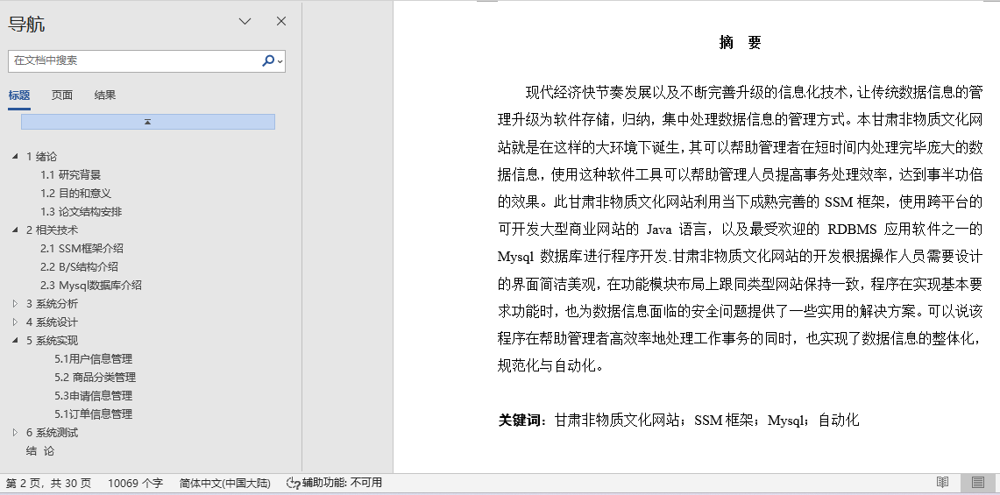
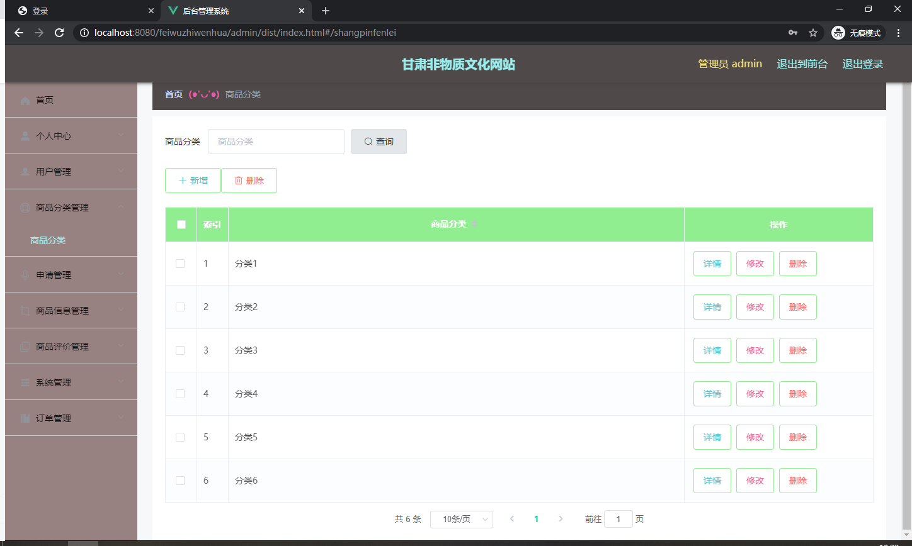
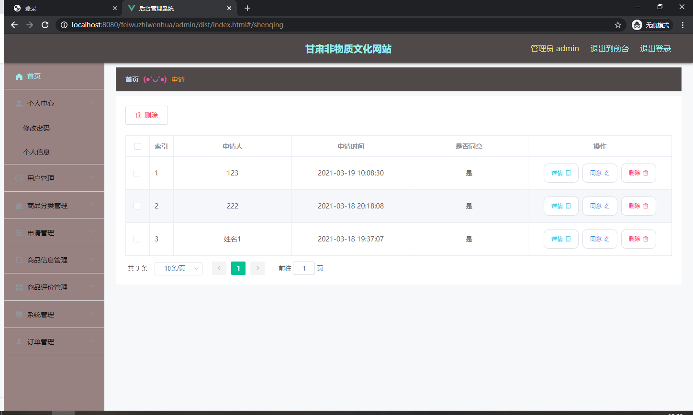
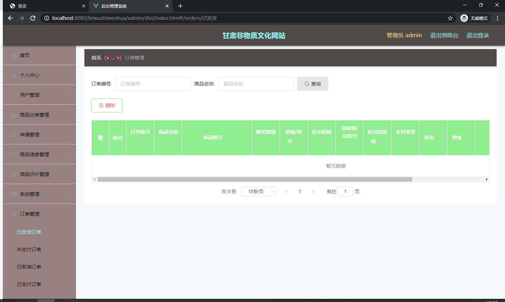
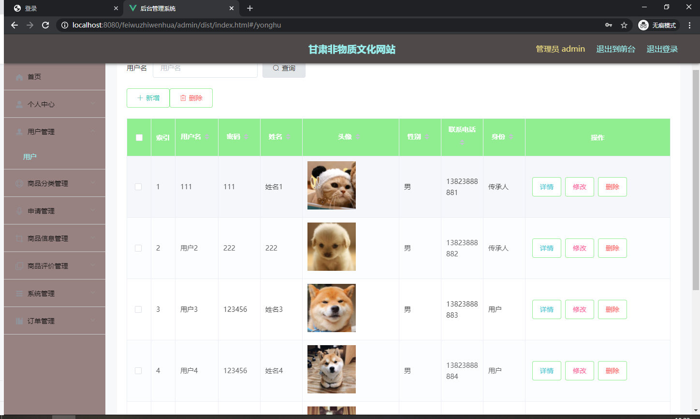

## 基于SpringBoot的甘肃非物质文化网站(程序+报告)

###  获取sql数据库文件: 从戎源码网 (https://armycodes.com/) QQ: 386869957 QQ群: 377586148
###  所有系统地址: (https://github.com/YuLin-Coder/AllProjectCatalog) 
###  所有项目以及源代码本人均调试运行无问题 可支持远程安装部署调试、定制修改、代码讲解

## 项目介绍
基于SpringBoot的甘肃非物质文化网站，系统包含两种角色：用户、管理员，系统分为前台和后台两大模块，主要功能如下：

用户信息管理

用户信息管理页面为管理员提供了以下功能：
- 查询管理用户信息
- 删除用户信息
- 修改用户信息
- 新增用户信息
- 对用户名称进行模糊查询

商品分类管理

商品分类管理页面为管理员提供了以下功能：
- 查看已发布的商品分类数据
- 修改商品分类
- 作废商品分类（即删除商品分类）

申请信息管理

申请信息管理页面为管理员提供了以下功能：
- 查看用户的申请信息
- 作废申请信息（即删除申请信息）

订单信息管理

订单信息管理页面为管理员提供了以下功能：
- 查看用户的订单信息
- 作废订单信息（即删除订单信息）

## 项目技术
- 编程语言：Java
- 数据库：MySQL
- 项目管理工具：Maven
- 前端技术：HTML、CSS、JavaScript、Jquery、Vue
- 后端技术：Spring、SpringMVC、MyBatis

## 运行环境
- JDK版本：JDK1.8及以上
- 开发工具：IDEA、Ecplise、Myecplise都可以
- 数据库: MySQL5.7及以上
- Maven：maven3.0及以上
- Node：14.14.0及以上

## 运行截图

